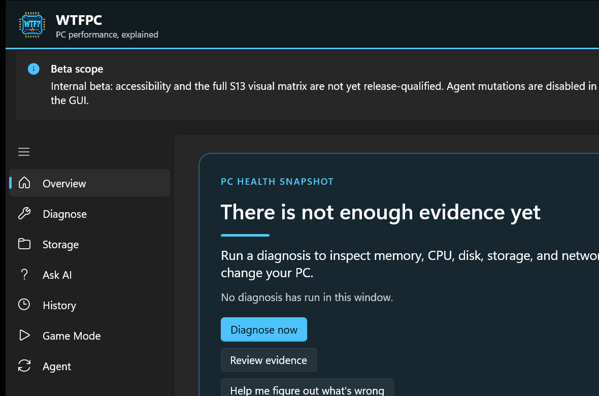

<div align="center">


# WTFPC
### *What the Fuck is My PC Doing?*

**by SystemReady**

Real answers for where your memory, CPU, disk, and network actually
went — not another 400-row process list to interpret yourself.

[**Download the beta →**](../../releases)

</div>

---

## The problem

Open Task Manager on a real machine and you get roughly 400 processes, a
"Memory" column that doesn't reconcile with itself, and no way to tell
whether that's actually a problem. 32 `Code.exe` processes are one VS
Code window. 17 `firefox.exe` processes are one browser with some tabs
open. About a dozen things are actually happening on your computer at
any given moment — Task Manager shows you 400 rows and leaves the
correlation to you.

**WTFPC does the correlation for you, and shows its work.**

## CLI or GUI — your choice

Run it as a scriptable command line, or as a full desktop app. Same
engine underneath, so the numbers always agree.

<p align="center">
  
</p>

The desktop app adds a **Storage** page for full-volume ownership scans,
**Game Mode** for frame-time and telemetry capture during a play
session, and **Ask AI** — which turns any diagnosis into a local,
previewable report you can hand to Claude or ChatGPT for a plain-English
explanation of what's going on, without ever leaving your machine
unless you choose to share it.

The CLI covers the same ground for scripting and automation — every
command supports `--json` for machine-readable output.

## See it in action

```
$ wtfpc why memory

In use 36.7 GB of 63.2 GB (58%)

  VS Code                        6.87 GB    32 processes
  Firefox                        4.12 GB    17 processes
    Tab content                  3.10 GB    12 processes
    GPU / compositor             0.52 GB
    Extensions                   0.31 GB     4 processes
  Memory Compression              4.59 GB
  Docker Desktop (vmmemWSL)       1.81 GB
  ...

  Standby (reclaimable)          18.33 GB
```

## Why it's accurate

Task Manager's per-process memory is *working set*, which double-counts
every shared page across every process that maps it — inflating totals
by 1.5–3.6x, and unevenly, which breaks ranking as much as it breaks the
total. WTFPC attributes by **private working set** instead, and its
headline "in use" number reconciles against the machine's physical
memory to within a point of what Windows itself reports. Nothing is
asserted without a measurement behind it.

## What it will never do

- Run as admin or LocalSystem
- Read your tab titles, URLs, or file contents
- Phone home — no cloud, no telemetry, local-first by default
- Kill or touch any of your processes — it explains, it doesn't act

## Private beta

You're seeing this because you've been invited into WTFPC's private beta
ahead of its commercial release. A few things worth knowing:

- Builds here are **pre-release and unsigned**. Windows SmartScreen will
  warn about an unknown publisher; that is expected for this stage, and
  every build's SHA-256 is published in `SHA256SUMS` beside it so you can
  verify what you downloaded. Production signing arrives before general
  availability.
- Features and output may still change before general availability.
- This link and the installer are for the invited test group only —
  please don't forward them outside that group.

Your feedback directly shapes what ships. Thank you for helping test it
early.

## Get the beta

Grab the latest build from the [**Releases**](../../releases) page.
Requires Windows 10/11, x64.

## License

© 2026 Suma Sapo Enterprises, Inc. All rights reserved. See
[LICENSE](LICENSE). Builds distributed here are for evaluation by
invited beta participants only; no other rights are granted.
